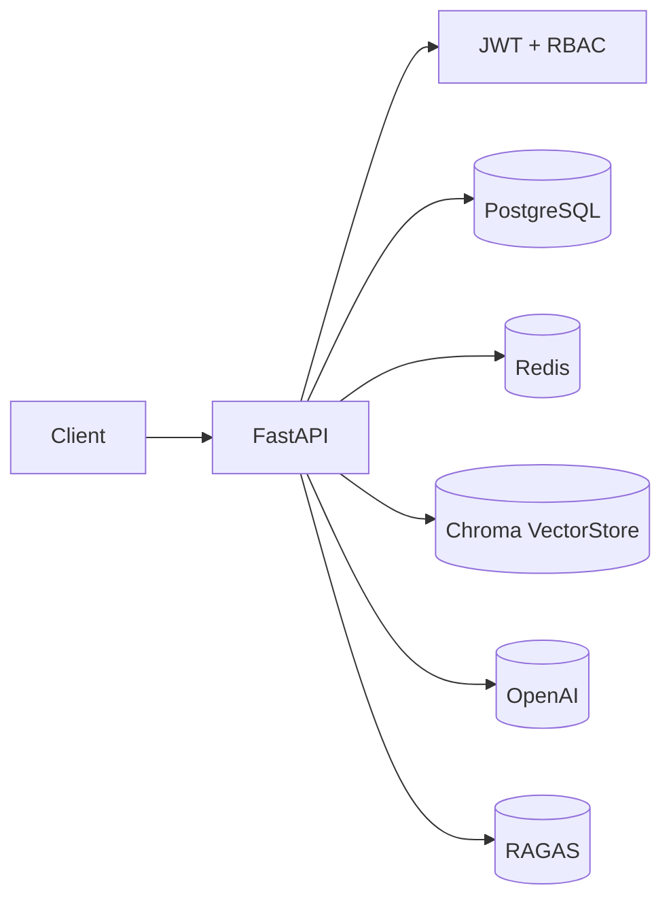

# 生产化 RAG 平台（FastAPI + PostgreSQL + Redis）

面向 **AI Agent 开发岗位** 的生产化 RAG 平台示例，强调：
- 用户隔离（租户级别）
- JWT 鉴权 + RBAC
- PostgreSQL 持久化（租户/用户/文档/审计）
- Redis 限流
- 向量检索（Chroma）+ 索引管理
- 审计日志
- 评测流水线触发入口（RAGAS）

## 架构图（Mermaid）


## 快速启动

```bash
python -m venv .venv
.venv\Scripts\activate
pip install -r requirements.txt

copy .env.example .env
# 修改 .env（OPENAI_API_KEY、DB、Redis）

docker compose up -d

python scripts/seed.py
python run_server.py
# 打开 http://localhost:8000/admin
```

## API 概览
- `POST /api/auth/tenants`：创建租户
- `POST /api/auth/users`：创建用户
- `POST /api/auth/login`：登录获取 token
- `GET /api/docs/`：当前租户文档列表
- `POST /api/docs/`：新增文档记录
- `POST /api/docs/{id}/index`：索引文档
- `POST /api/docs/query`：检索问答
- `GET /api/admin/audit-logs`：审计日志（owner）
- `POST /api/eval/run`：触发评测（owner）

## 面试重点（可直接讲）
1. 为什么做租户隔离：企业场景必须数据隔离  
2. 为什么加 Redis：在线服务必须限流和可观测  
3. 为什么加 RAGAS：RAG 不能只靠主观，需要量化指标  
4. 为什么 Agent：复杂问题不是单轮检索能解决

## DeepSeek 接入说明

本项目已支持 DeepSeek 兼容接口（OpenAI 协议）。

配置方式：
- 设置环境变量：
  - DEEPSEEK_API_KEY
  - DEEPSEEK_BASE_URL（默认 https://api.deepseek.com）
  - DEEPSEEK_MODEL（默认 deepseek-chat）

LLM 调用封装：
- app/services/llm.py

## 一键生成 .env（推荐）

运行命令：
```bash
python scripts/generate_env.py
```
按提示输入 DeepSeek Key 和数据库/Redis 配置，即可自动生成 `.env`。
